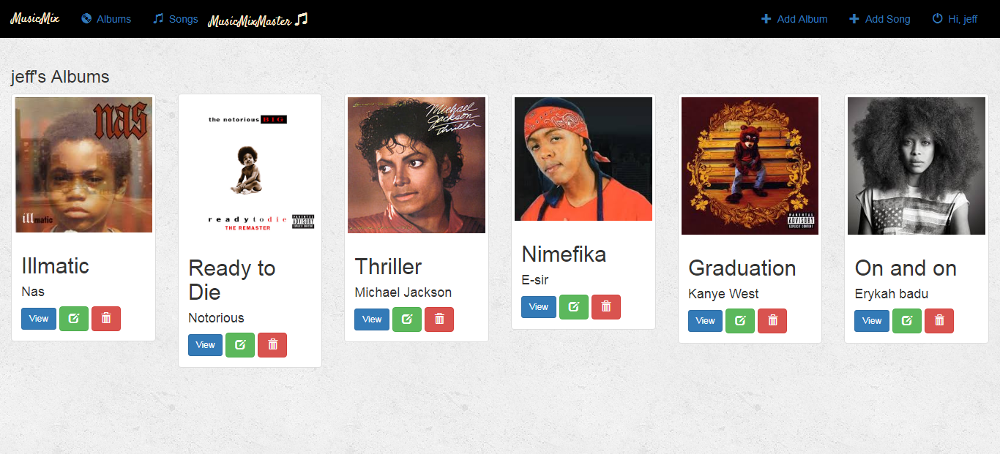
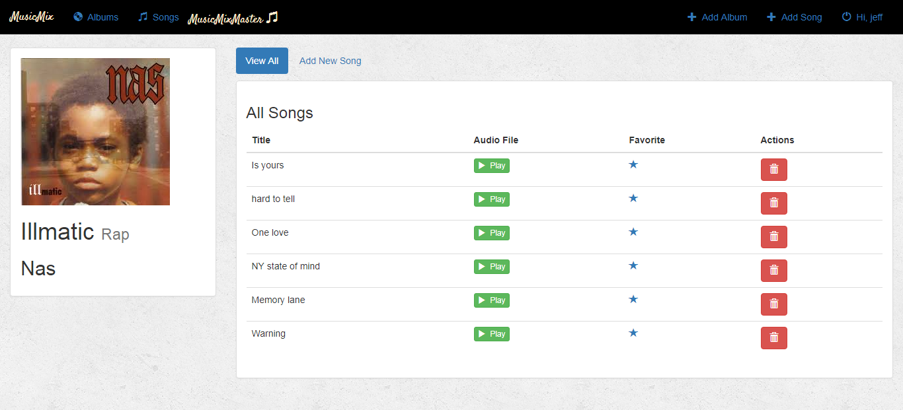
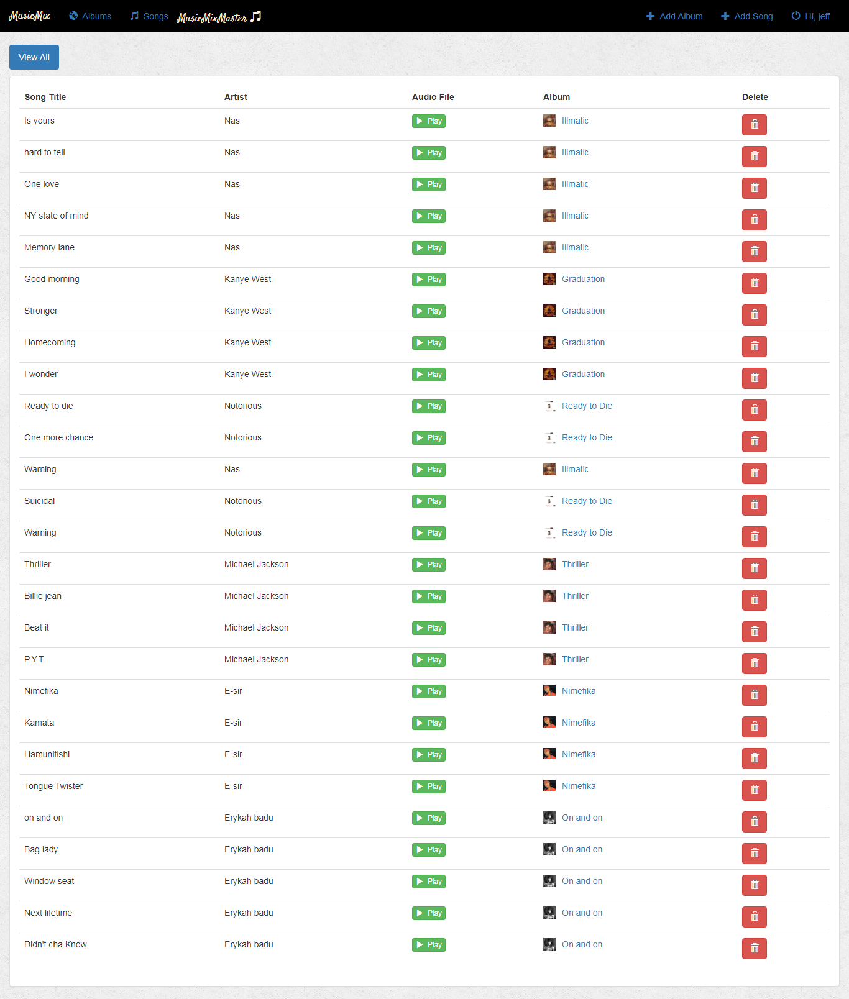
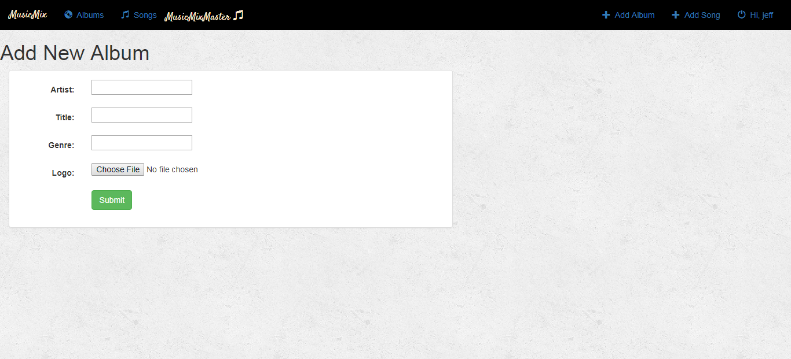
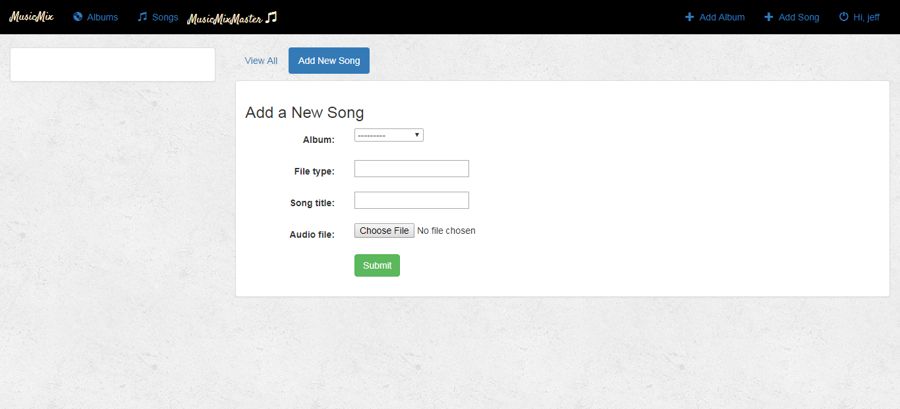

# musicMix
This is a music app that allows you to create an album of your favorite artists with the songs.
The app is built in Python/Django and sqlite as the database.

you can download or clone it to add some more functionalities which may not be there

Here is a sneak preview of the app project

Happy Coding!!
